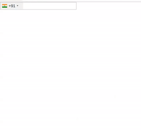

# AngularJS - Phone Number Input

An AngularJS package for entering and validating international telephone numbers. It also adds a flag dropdown to any input, detects the user's country, displays a relevant placeholder and provides formatting / validation methods.

## Table of contents

- [Supports](#supports)
- [Demo](#demo)
- [Install Dependencies](#install-dependencies)
- [Add Dependency Style](#add-dependency-style)
- [Usage](#usage)
- [Example](#example)
- [Options](#options)
- [Methods](#methods)
- [Supported Formats](#supported-formats)
- [Want to Contribute?](#want-to-contribute)
- [Collection of Components](#collection-of-components)
- [Changelog](#changelog)
- [Credits](#credits)
- [License](#license)
- [Keywords](#Keywords)

## Supports:

- Angular 8
- Angular 9
- ReactiveFormsModule
- FormsModule
- Validation with [google-libphonenumber](https://github.com/ruimarinho/google-libphonenumber)


## Demo

[](https://github.com/weblineindia/AngularJS-Phone-Number-Input/phone.gif)


### Install Dependencies

`$ npm install angular-weblineindia-phone-number --save`

`$ npm install google-libphonenumber --save`

`$ ng add ngx-bootstrap`

### Add Dependency Style

Add _'angular-weblineindia-phone-number'_ style file:

`./node_modules/angular-weblineindia-phone-number/build/css/intlTelInput.css`

to **angular.json** styles array:

```json

"styles": [
  "./node_modules/bootstrap/dist/css/bootstrap.min.css",
  "./node_modules/ngx-bootstrap/datepicker/bs-datepicker.css",
  "./node_modules/angular-weblineindia-phone-number/build/css/intlTelInput.css",
  "src/styles.css"
],

```

### Install This Library

`$ npm install angular-weblineindia-phone-number --save`

## Usage

Add `BsDropDownModule` and `PhoneModule` to your module file:

```javascript
import { PhoneModule } from "angular-weblineindia-phone-number";

imports: [BsDropdownModule.forRoot(), PhoneModule];
```

## Example


```html
<div *ngFor="let value of phoneNumberValue;let indexOfelement=index;">
  <lib-phone
    [value]="value.phone"
    [index]="indexOfelement"
    (onMultiple)="onMultiplePhone()"
    (change)="onChangeInput($event)"
    [phoneArray]="phoneNumberValue"
    [isShowPlus]="phoneNumberValue.length-1 === indexOfelement"
    [phoneValidationErrorMsg]="phoneValue.phoneValidationErrorMsg"
    [phoneUniqueErrorMsg]="phoneValue.phoneUniqueErrorMsg"
    [maxLength]="phoneValue.maxLength"
    [isMultiple]="phoneValue.isMultiple"
  ></lib-phone>
</div>
```

```typescript
import { Component } from "@angular/core";

@Component({
  selector: "app-root",
  templateUrl: "./app.component.html",
  styleUrls: ["./app.component.css"]
})
export class AppComponent {
  phoneNumberValue: any = [
    {
      phone: "",
      code: ""
    }
  ];
  phoneValue: any = {
    phoneValidationErrorMsg: "Phone number is invalid",
    phoneUniqueErrorMsg: "Do not enter same phone number",
    maxLength: 15,
    isMultiple: true
  };

  onMultiplePhone() {
    this.phoneNumberValue.push({ phone: "" });
  }
  onChangeInput(data) {
    this.phoneNumberValue[data.index].phone = data.event.target.value;
    this.phoneNumberValue[data.index].code = data.code;
  }
}
```

## Options

| Options                  | Type                     | Default                    | Description                                                                                                   |
| ------------------------ | ------------------------ | -------------------------- | ------------------------------------------------------------------------------------------------------------- |
| cssClass                 | `string`                 | `control-form`             | Bootstrap input css class or your own custom one.                                                             |
| preferredCountries       | `<CountryISO>[]`         | `[]`                       | List of countries, which will appear at the top.                                                              |
| onlyCountries            | `<CountryISO>[]`         | `[]`                       | List of manually selected countries, which will appear in the dropdown.                                       |
| enableAutoCountrySelect  | `boolean`                | `false`                    | Toggle automatic country (flag) selection based on user input.                                                |
| enablePlaceholder        | `boolean`                | `true`                     | Input placeholder text, which addapts to the country selected.                                                |
| searchCountryFlag        | `boolean`                | `false`                    | Enables input search box for countries in the flag dropdown.                                                  |
| searchCountryField       | `<SearchCountryField>[]` | `[SearchCountryField.All]` | Customize which fields to search in, if `searchCountryFlag` is enabled. Use `SearchCountryField` helper enum. |
| searchCountryPlaceholder | `string`                 | `'Search Country'`         | Placeholder value for `searchCountryField`                                                                    |
| maxLength                | `number`                 | `None`                     | Add character limit.                                                                                          |
| tooltipField             | `<TooltipLabel>`         | `None`                     | Set tooltip on flag hover. Use `TooltipLabel` helper enum for label type options.                             |
| selectFirstCountry       | `boolean`                | `true`                     | Selects first country from `preferredCountries` if is set. If not then uses main list.                        |
| phoneValidation          | `boolean`                | `true`                     | Disable phone validation.                                                                                     |
| inputId                  | `string`                 | `phone`                    | Unique ID for `<input>` element.                                                                              |
| selectedCountryISO       | `<CountryISO>`           | `None`                     | Set specific country on load.                                                                                 |
| separateDialCode         | `boolean`                | `false`                    | Visually separate dialcode into the drop down element.                                                        |
| countryChange            | `<Country>`              | `None`                     | Emits country value when the user selects a country from the dropdown.                                        |
| phoneValidationErrorMsg            | `string`              |                      | default phone validation error message                                       |
| phoneUniqueErrorMsg            | `string`              |                      | default phone unique error message                                       |
| maxLength            | `number`              |      15                | default phone maxlength                                       |
| isMultiple            | `boolean`              |      true                | for add multiple phone number                                        |


## Methods

| Name       | Description                                  |
| ---------- | -------------------------------------------- |
| onMultiple | Gets triggered when click on plus icon.      |
| change     | Gets triggered every time input got changed. |

## Supported Formats

Following formats are supported

- NATIONAL // Produces "044 668 18 00"
- INTERNATIONAL // Produces "+41 44 668 18 00"
- E164 // Produces "+41446681800"

## Want to Contribute?

- Created something awesome, made this code better, added some functionality, or whatever (this is the hardest part).
- [Fork it](http://help.github.com/forking/).
- Create new branch to contribute your changes.
- Commit all your changes to your branch.
- Submit a [pull request](http://help.github.com/pull-requests/).

---

## Collection of Components

We have built many other components and free resources for software development in various programming languages. Kindly click here to view our [Free Resources for Software Development](https://www.weblineindia.com/software-development-resources.html)

---

## Changelog

Detailed changes for each release are documented in [CHANGELOG.md](./CHANGELOG.md).

## Credits

angular-weblineindia-phone-number is inspired by the [ngx-intl-tel-input](https://www.npmjs.com/package/ngx-intl-tel-input).

## License

[MIT](LICENSE)

[mit]: https://github.com/weblineindia/AngularJS-Phone-Number-Input/blob/master/LICENSE

## Keywords

angularjs, angular-weblineindia-phone-number, phone-number-validation, angular-phonenumber-input, phone-number-input, phone-input-class, international-telephone-input, telephone-input
